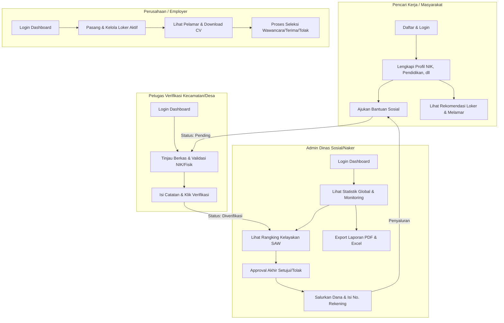

# e-MatchKerja 💼

**e-MatchKerja** adalah platform web terpadu yang menggabungkan portal karir pencarian lowongan kerja lokal dengan **Sistem Pendukung Keputusan (SPK)** penyaluran bantuan sosial menggunakan metode **Simple Additive Weighting (SAW)**. 

Aplikasi ini dirancang untuk mempermudah pencari kerja menemukan karir yang sesuai secara transparan sekaligus memastikan bantuan sosial dari instansi dinas disalurkan secara objektif, transparan, dan tepat sasaran berdasarkan kriteria-kriteria kemiskinan dan kerentanan ekonomi terukur.

---

## 💡 Ide Utama & Latar Belakang

Sering kali terdapat kesenjangan koordinasi antara penanganan pengangguran dan penyaluran bantuan sosial. Pencari kerja yang menganggur membutuhkan bantuan finansial sementara/pelatihan, sedangkan instansi dinas kesulitan memverifikasi secara langsung kelayakan penerima bantuan di lapangan secara objektif.

**e-MatchKerja hadir sebagai solusi satu pintu (one-stop solution):**
1. **Bagi Masyarakat/Pencari Kerja**: Menyediakan wadah terpadu untuk melamar pekerjaan secara lokal sekaligus mengajukan bantuan sosial/pelatihan jika memenuhi syarat.
2. **Bagi Perusahaan (Employer)**: Membantu mempublikasikan lowongan kerja dan menyaring tenaga kerja lokal secara efisien.
3. **Bagi Pemerintah (Petugas Verifikasi & Admin Dinas)**: Memberikan alat bantu pengawasan berbasis data riil lapangan (verifikasi bertingkat) yang dipadukan dengan perhitungan matematis algoritma **SAW** untuk merangking kelayakan penerima bantuan secara adil dan terkomputerisasi.

---

## 👥 Struktur Tim & Tanggung Jawab

Berdasarkan rancangan pembagian modul, proyek e-MatchKerja dikerjakan oleh tim dengan pembagian tugas sebagai berikut:

| No | Peran Tim | Tanggung Jawab Utama | Modul / Fitur yang Dikerjakan |
|:---|:---|:---|:---|
| **1** | **Project Leader & Full Stack** | Koordinasi tim, desain arsitektur database, sistem autentikasi, manajemen hak akses, dan deployment sistem. | <ul><li>Sistem Autentikasi (Multi-role login)</li><li>Manajemen Role & Permission</li><li>Manajemen Profil Pengguna</li><li>Sistem Notifikasi Real-time</li><li>Integrasi Keseluruhan Sistem</li></ul> |
| **2** | **Backend & Algorithm Specialist** | Logika bisnis inti aplikasi, implementasi algoritma pendukung keputusan (SPK), pencocokan data (matching), dan riwayat bantuan. | <ul><li>Logika & Algoritma SPK SAW</li><li>Sistem Scoring Kerentanan Ekonomi</li><li>Automated/Rule-based Job Matching</li><li>Proses Penyaluran Dana</li><li>Log Transaksi & Riwayat Bantuan</li></ul> |
| **3** | **Frontend & Dashboard Specialist** | Desain antarmuka (UI/UX), visualisasi statistik interaktif, peta wilayah, dan penataan layout dashboard premium. | <ul><li>Dashboard Dinamis per Role (Admin, Verifikator, Perusahaan, Pencari Kerja)</li><li>Integrasi Chart.js untuk Grafik Statistik</li><li>Integrasi Leaflet.js untuk Visualisasi Peta Wilayah</li><li>Responsive Web Layout & Styling</li></ul> |
| **4** | **Data & Management Specialist** | Pengelolaan data berskala besar (CRUD berat), fitur pencarian canggih, pemfilteran data, dan pengelolaan unggahan berkas. | <ul><li>Manajemen Data Pencari Kerja (Admin & Verifikator)</li><li>Manajemen Loker Perusahaan (CRUD Loker)</li><li>Search, Filter, & Pagination</li><li>Upload & Storage Manager (CV, KTP, KK)</li></ul> |
| **5** | **Business Process & Tester** | Alur persetujuan bantuan (multi-level), pelaporan data terpadu, ekspor dokumen, pengujian fungsionalitas (QA), dan penyusunan manual. | <ul><li>Workflow Approval Bantuan Sosial (Pending $\rightarrow$ Verified $\rightarrow$ Approved $\rightarrow$ Disbursed)</li><li>Modul Laporan & Export Data (Excel & PDF)</li><li>UAT (User Acceptance Testing)</li><li>Penyusunan Dokumentasi & User Manual</li></ul> |

---

## 🔑 Pembagian Peran (Role) & Hak Akses

Sistem membedakan hak akses dan alur kerja menjadi **4 Peran Utama**:



### 1. Admin Dinas (Super User / Pemerintah Pusat)
*   **Tujuan**: Mengawasi jalannya seluruh sistem, mengendalikan data master, dan memegang kuasa persetujuan akhir.
*   **Alur Kerja Utama**:
    1.  Login $\rightarrow$ Dashboard Admin Dinas.
    2.  Memantau statistik real-time (tingkat pengangguran, total dana bantuan sosial disalurkan, jumlah lowongan aktif).
    3.  Mengakses **SPK Kelayakan Bantuan** untuk melihat perankingan otomatis kandidat penerima bantuan (berdasarkan perhitungan SAW).
    4.  Melakukan **Approval Akhir** (Menyetujui / Menolak) permohonan yang telah divalidasi oleh petugas lapangan.
    5.  Melakukan **Penyaluran Bantuan** dengan memasukkan nomor rekening tujuan untuk mengubah status menjadi *Disalurkan*.
    6.  Mengakses laporan data terintegrasi dan melakukan **Export Excel & PDF**.
    7.  Mengelola data master user, profil pencari kerja, dan lowongan kerja.

### 2. Petugas Verifikasi (Petugas Lapangan Kecamatan/Desa)
*   **Tujuan**: Memastikan keabsahan data pemohon secara administratif maupun kondisi riil di lapangan sebelum diajukan ke dinas.
*   **Alur Kerja Utama**:
    1.  Login $\rightarrow$ Dashboard Petugas.
    2.  Melihat antrean pengajuan bantuan berstatus *Pending* dan profil pencari kerja yang belum terverifikasi (*Unverified*).
    3.  Memeriksa berkas KTP, KK, serta detail pengisian data diri pemohon.
    4.  Memberikan **Catatan Hasil Verifikasi Lapangan** (misalnya konfirmasi kesesuaian fisik atau alamat).
    5.  Melakukan **Verifikasi Data Diri** dan **Verifikasi Pengajuan** (mengubah status dari *Pending* $\rightarrow$ *Diverifikasi*).
    6.  *Catatan: Petugas tidak berhak melakukan approval akhir (menyetujui penyaluran dana/bantuan), tugasnya murni validasi data.*

### 3. Pencari Kerja / Masyarakat
*   **Tujuan**: Mencari pekerjaan yang relevan sekaligus memperoleh hak bantuan sosial pemerintah secara transparan.
*   **Alur Kerja Utama**:
    1.  Login $\rightarrow$ Dashboard Pencari Kerja.
    2.  Melengkapi **Profil Saya** (NIK, tanggal lahir, pendidikan terakhir, status pekerjaan, pendapatan bulanan, jumlah tanggungan, serta upload file KTP & KK).
    3.  Mengakses **Cari Lowongan Kerja** untuk melihat loker aktif dan memfilternya berdasarkan pencarian kata kunci, lokasi, maupun gaji minimum.
    4.  Mengirimkan lamaran pekerjaan dengan mengunggah CV (format PDF) dan Portofolio.
    5.  Mengakses menu **Pengajuan Bantuan**, memilih jenis bantuan (Subsidi Upah, Pelatihan, Modal UMKM), menginput nominal yang diajukan, dan menulis alasan detail pengajuan bantuan.
    6.  Memantau status permohonan bantuan secara real-time via *Progress Tracker* di dasbor.
    7.  Memantau riwayat status lamaran kerja (Pending, Dipanggil Wawancara, Diterima, Ditolak).
    8.  *Catatan: Pencari kerja tidak memiliki akses untuk mengunduh laporan global sistem.*

### 4. Perusahaan / Employer
*   **Tujuan**: Membuka lowongan pekerjaan dan menyaring tenaga kerja lokal terbaik yang terdaftar resmi.
*   **Alur Kerja Utama**:
    1.  Login $\rightarrow$ Dashboard Perusahaan.
    2.  Mengisi form **Buat Lowongan Baru** (posisi, deskripsi pekerjaan, gaji min-max, lokasi, kuota penerimaan, deadline, dan tags skill yang dibutuhkan).
    3.  Mengelola postingan loker (menonaktifkan loker yang kuotanya terpenuhi, mengedit detail, atau menghapusnya).
    4.  Melihat daftar pelamar untuk masing-masing loker beserta berkas CV dan Portofolio yang diunggah pelamar.
    5.  Mengubah status lamaran kerja pelamar (*Dipanggil Wawancara*, *Diterima*, atau *Ditolak*) yang otomatis mengirimkan notifikasi ke dasbor pencari kerja terkait.
    6.  *Catatan: Perusahaan tidak memiliki akses ke modul pengajuan bantuan sosial milik dinas maupun data internal pemerintah lainnya.*

---

## 🧮 Algoritma SPK SAW (Simple Additive Weighting)

Sistem menggunakan metode **SAW** (metode penjumlahan terbobot) untuk menentukan prioritas kelayakan pencari kerja dalam menerima bantuan sosial. Kandidat yang dirangking adalah pencari kerja yang status profilnya sudah diverifikasi oleh petugas lapangan (`status_verifikasi = 'Verified'`).

### 1. Kriteria & Bobot Penilaian
Sistem menentukan 5 kriteria utama (C1 s.d C5) beserta bobot masing-masing sesuai data di `KriteriaSeeder`:

| Kode | Nama Kriteria | Tipe Kriteria | Bobot ($W$) | Keterangan Skor Internal |
|:---:|:---|:---:|:---:|:---|
| **C1** | Status Kerja Saat Ini | **Benefit** | 0.25 (25%) | PHK = 3, Menganggur = 2, Bekerja Serabutan = 1, Lainnya = 0. |
| **C2** | Lama Menganggur | **Benefit** | 0.20 (20%) | >12 bulan = 3, 6-12 bulan = 2, <6 bulan = 1, Bekerja = 0. |
| **C3** | Pendapatan Bulanan | **Cost** | 0.25 (25%) | Semakin kecil pendapatan, prioritas kelayakan semakin tinggi. |
| **C4** | Jumlah Tanggungan | **Benefit** | 0.15 (15%) | Semakin banyak tanggungan keluarga, prioritas semakin tinggi. |
| **C5** | Penerimaan Bansos Lain | **Cost** | 0.15 (15%) | Ya (Sudah Menerima) = 1, Tidak = 0. (Prioritas bagi yang belum mendapat bansos). |

### 2. Rumus Normalisasi Matriks Keputusan ($r_{ij}$)
*   Untuk kriteria **Benefit** (C1, C2, C4):
    $$r_{ij} = \frac{x_{ij}}{\max(x_{ij})}$$
*   Untuk kriteria **Cost** (C3, C5):
    $$r_{ij} = \frac{\min(x_{ij})}{x_{ij}}$$

### 3. Rumus Nilai Preferensi Akhir ($V_i$)
Setiap alternatif pencari kerja dihitung nilai preferensinya menggunakan formula:
$$V_i = \sum_{j=1}^{n} (W_j \cdot r_{ij})$$

*   $V_i$ : Nilai akhir preferensi alternatif ke-$i$.
*   $W_j$ : Bobot kriteria ke-$j$.
*   $r_{ij}$ : Nilai normalisasi kriteria ke-$j$ untuk alternatif ke-$i$.

Kandidat diurutkan dari skor $V_i$ terbesar ke terkecil. Skor tertinggi merepresentasikan prioritas utama untuk disetujui bantuannya oleh Admin Dinas.

---

## 🛠️ Panduan Instalasi & Setup Lokal

### 1. Prasyarat Sistem
*   **PHP** $\ge$ 8.3
*   **Composer**
*   **Node.js & NPM**
*   **MySQL / MariaDB** (melalui Laragon, XAMPP, atau Docker)

### 2. Langkah-Langkah Instalasi
1.  **Kloning Repositori**:
    ```bash
    git clone https://github.com/UsernameAnda/e-MatchKerja.git
    cd e-MatchKerja
    ```
2.  **Instal Dependencies**:
    ```bash
    composer install
    npm install
    ```
3.  **Konfigurasi File Environment**:
    *   Salin file `.env.example` menjadi `.env`
    *   Sesuaikan konfigurasi database:
    ```env
    DB_CONNECTION=mysql
    DB_HOST=127.0.0.1
    DB_PORT=3306
    DB_DATABASE=e_matchkerja
    DB_USERNAME=root
    DB_PASSWORD=
    ```
    *   *Buat database kosong bernama `e_matchkerja` di server MySQL lokal Anda.*
4.  **Inisialisasi Aplikasi**:
    ```bash
    php artisan key:generate
    php artisan storage:link
    ```
5.  **Migrasi & Seeding Database**:
    Menyiapkan seluruh skema tabel, data kriteria SAW, serta akun demo siap pakai:
    ```bash
    php artisan migrate:fresh --seed
    ```
6.  **Jalankan Server Lokal**:
    *   Jalankan server Laravel:
        ```bash
        php artisan serve
        ```
    *   Jalankan Vite compiler (untuk visualisasi dan styling CSS/JS) di terminal terpisah:
        ```bash
        npm run dev
        ```
    *   Akses platform melalui browser pada URL [http://127.0.0.1:8000](http://127.0.0.1:8000).

---

## 🔑 Akun Demo Pengujian (Seeder Credentials)

| Peran (Role) | Alamat Email | Password |
| :--- | :--- | :--- |
| **Admin Dinas** | `admin@ematchkerja.test` | `password` |
| **Petugas Verifikasi** | `petugas@ematchkerja.test` | `password` |
| **Pencari Kerja 1** | `pencari1@ematchkerja.test` | `password` |
| **Pencari Kerja 2** | `pencari2@ematchkerja.test` | `password` |

---

## 🔍 Hasil Peninjauan (Review) Kode & Rekomendasi Teknis

Berdasarkan hasil peninjauan kode mendalam pada berkas controller, model, migrasi, dan routing, berikut temuan penting yang perlu diperhatikan oleh tim pengembang:

### 1. Perbaikan Bug & Penyelarasan Alur yang Telah Dilakukan
*   **Penyatuan Dasbor Dinamis**: Halaman dasbor diintegrasikan menggunakan blade tunggal dengan tata letak visual premium yang merespon peran aktif pengguna secara real-time.
*   **Pembersihan Tabel Duplikat**: Telah dihapus migrasi duplikat `profiles_pencari_kerja` yang dapat memicu crash relasi database, sehingga sistem secara konsisten menggunakan tabel `job_seeker_profiles`.
*   **Sinkronisasi Routing**: Memperbaiki method `salurkan` pada penyaluran bantuan di `routes/web.php` dan `PengajuanBantuanController` agar tidak memicu error *ActionNotFoundException*.
*   **Perbaikan Enum Seeder**: Sinkronisasi data enum `status_kerja_saat_ini` pada database seeder agar sesuai dengan pembatasan skema migrasi database (`['Menganggur', 'Bekerja', 'Freelance', 'Wirausaha']`).

### 2. Rekomendasi & Catatan Pengembangan Masa Depan (Gaps to Fix)
*   **Sinkronisasi Fitur Skill Matching**:
    *   **Temuan**: Tabel `job_seeker_profiles` memiliki kolom `skills_tags` (JSON) dan `pengalaman_kerja` (Text), namun pada Controller `JobSeekerProfileController` dan form view `profile.edit` / `profile.create`, kolom-kolom ini **belum ditambahkan ke form input**.
    *   **Dampak**: Pengguna belum bisa mengisi keahlian khusus mereka dari halaman UI, sehingga pencocokan lowongan otomatis berbasis kecocokan keahlian (*skill matching*) belum bekerja secara dinamis penuh.
    *   **Rekomendasi**: Tambahkan input tags (menggunakan Tagify atau input teks comma-separated) pada form edit profil pencari kerja dan validasikan di controller untuk disimpan ke kolom `skills_tags`. Dengan demikian, tim Backend dapat mengaktifkan pencocokan otomatis (*rule-based skill matching*) dengan data `skill_dibutuhkan` di tabel `lowongan_kerja`.
*   **Status Kerja pada SAW Service**:
    *   **Temuan**: Method `skorStatusKerja()` di `SawService` mencari nilai `'PHK'` dan `'Bekerja Serabutan'` yang sudah tidak ada di enum database baru (setelah diperbaiki menjadi `'Menganggur'`, `'Bekerja'`, `'Freelance'`, `'Wirausaha'`).
    *   **Rekomendasi**: Ubah fungsi pemetaan skor pada `SawService.php` agar mencocokkan nilai enum baru:
        ```php
        private function skorStatusKerja($status) {
            return match($status) {
                'Menganggur' => 3,
                'Freelance'  => 2,
                'Wirausaha'  => 1,
                'Bekerja'    => 0,
                default      => 0
            };
        }
        ```
