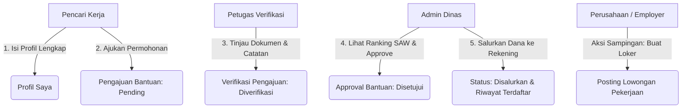

# e-MatchKerja 💼

**e-MatchKerja** adalah platform web terpadu yang menggabungkan portal karir pencarian lowongan kerja lokal dengan **Sistem Pendukung Keputusan (SPK)** penyaluran bantuan sosial menggunakan metode **Simple Additive Weighting (SAW)**. Aplikasi ini dirancang untuk mempermudah pencari kerja menemukan karir yang sesuai sekaligus memastikan bantuan sosial dari instansi dinas disalurkan secara objektif, transparan, dan tepat sasaran.

---

## 🚀 Panduan Instalasi & Setup (Dari Git Clone ke Running)

Ikuti langkah-langkah di bawah ini untuk menjalankan proyek e-MatchKerja di komputer lokal Anda:

### 1. Prasyarat Sistem
Pastikan komputer Anda sudah terinstal:
*   **PHP** (minimal versi 8.3)
*   **Composer** (pengelola library PHP)
*   **Node.js & NPM** (untuk kompilasi aset frontend)
*   **MySQL / MariaDB** (melalui Laragon, XAMPP, atau database manager lokal)

### 2. Kloning Repositori
Buka terminal/CMD Anda, lalu jalankan perintah kloning:
```bash
git clone https://github.com/UsernameAnda/e-MatchKerja.git
cd e-MatchKerja
```

### 3. Instalasi Dependency Backend & Frontend
Instal semua package PHP (Laravel) dan JavaScript yang dibutuhkan:
```bash
# Instal Backend Library
composer install

# Instal Frontend Packages
npm install
```

### 4. Konfigurasi Environment (`.env`)
Salin file konfigurasi contoh dan buat file `.env` baru:
```bash
cp .env.example .env
```
Buka file `.env` yang baru dibuat menggunakan kode editor, lalu sesuaikan koneksi database Anda:
```env
DB_CONNECTION=mysql
DB_HOST=127.0.0.1
DB_PORT=3306
DB_DATABASE=e_matchkerja
DB_USERNAME=root
DB_PASSWORD=
```
*Catatan: Buat database kosong bernama `e_matchkerja` di phpMyAdmin atau DBMS lokal Anda sebelum melanjutkan.*

### 5. Generate Application Key & Storage Link
Buat key aplikasi Laravel dan hubungkan folder storage agar file scan dokumen (KTP/KK) dapat diakses secara publik:
```bash
php artisan key:generate
php artisan storage:link
```

### 6. Migrasi Database & Seeding Data Awal
Jalankan migrasi tabel beserta seeder untuk mempopulasikan role, kriteria SPK, dan akun demo pengujian:
```bash
php artisan migrate:fresh --seed
```

### 7. Jalankan Server Lokal
Jalankan server PHP dan compiler Vite frontend secara bersamaan:
```bash
# Jalankan web server Laravel
php artisan serve

# Jalankan Vite dev server (di terminal baru)
npm run dev
```
Aplikasi Anda sekarang aktif dan dapat diakses melalui browser di alamat [http://127.0.0.1:8000](http://127.0.0.1:8000).

---

## 👥 Akun Demo Pengujian (Seeder Credentials)

Anda dapat masuk menggunakan akun demo yang sudah disiapkan otomatis oleh seeder:

| Peran (Role) | Alamat Email | Password |
| :--- | :--- | :--- |
| **Admin Dinas** | `admin@ematchkerja.test` | `password` |
| **Petugas Verifikasi** | `petugas@ematchkerja.test` | `password` |
| **Pencari Kerja 1** | `pencari1@ematchkerja.test` | `password` |
| **Pencari Kerja 2** | `pencari2@ematchkerja.test` | `password` |

---

## 🔄 Alur & Skenario Penggunaan Website

Aplikasi ini memiliki alur proses terintegrasi yang melibatkan **4 Peran Utama**. Berikut adalah skenario langkah demi langkah untuk menggunakannya:



### Skenario 1: Sisi Pencari Kerja (Masyarakat)
1. **Registrasi/Login**: Pengguna mendaftar sebagai **Pencari Kerja / Masyarakat** atau login dengan akun `pencari1@ematchkerja.test`.
2. **Mengisi Profil**: Buka menu **Profil Saya**, lalu isi data secara lengkap (NIK, nama lengkap, tanggal lahir, jenis kelamin, pendidikan, status pekerjaan, lama menganggur, pendapatan bulanan, jumlah tanggungan, serta upload file KTP).
3. **Mengajukan Bantuan**: Setelah profil lengkap, buka menu **Pengajuan Bantuan**, pilih jenis bantuan sosial (misal: *Modal Usaha UMKM*), tulis nominal yang diajukan, dan berikan alasan detail (minimal 30 karakter). Status pengajuan pertama kali dikirim adalah **Pending**.
4. **Mencari Kerja**: Buka menu **Cari Pekerjaan** untuk meninjau kualifikasi lowongan aktif yang diposting oleh perusahaan dan melamar melalui tombol lamar.

### Skenario 2: Sisi Petugas Verifikasi (Petugas Lapangan)
1. **Login**: Petugas masuk ke sistem menggunakan email `petugas@ematchkerja.test`.
2. **Meninjau Pengajuan**: Pada dasbor, Petugas akan melihat daftar pengajuan bantuan masuk yang berstatus **Pending**.
3. **Verifikasi**: Buka detail pengajuan, baca alasan, dan tinjau lampiran berkas KTP pemohon. Petugas mengisi kolom **Catatan Hasil Verifikasi Lapangan** (misal: *"Berkas NIK terbukti valid setelah dicocokkan dengan fisik"*), kemudian mengklik tombol **Verifikasi Data**. Status pengajuan kini berubah menjadi **Diverifikasi**.

### Skenario 3: Sisi Admin Dinas (Dinas Sosial)
1. **Login**: Admin masuk menggunakan email `admin@ematchkerja.test`.
2. **Kalkulasi SAW Kelayakan**: Buka menu **SPK Kelayakan Bantuan**. Di sini, sistem otomatis melakukan kalkulasi menggunakan algoritma SAW berdasarkan kriteria (Status Kerja, Lama Menganggur, Pendapatan, Dependen, dan Penerimaan Bansos Lain). Hanya pencari kerja yang status profilnya sudah **Verified** yang akan diurutkan dari skor kelayakan tertinggi (Skor Preferensi V).
3. **Persetujuan Pengajuan**: Buka menu **Laporan Bantuan** atau detail pengajuan bantuan yang statusnya telah **Diverifikasi** oleh petugas. Isi **Catatan Persetujuan**, lalu klik **Setujui Pengajuan**. Status pengajuan kini berubah menjadi **Disetujui**.
4. **Penyaluran Dana**: Pada halaman detail pengajuan yang telah disetujui, Admin memasukkan nomor rekening bank penerima pada kolom penyaluran, lalu mengeklik **Tandai Telah Disalurkan**. Rekam data pembayaran otomatis tercatat di tabel `riwayat_bantuan`, dan status pengajuan selesai di tahapan **Disalurkan**.
5. **Unduh Rekap**: Admin dapat mengunduh seluruh rangkuman laporan dalam bentuk file Excel/CSV atau dokumen cetak PDF di menu **Laporan Bantuan**.

### Skenario 4: Sisi Perusahaan (Employer)
1. **Registrasi/Login**: Pengguna mendaftar sebagai **Perusahaan / Employer** (atau dibuat melalui registrasi form awal).
2. **Posting Lowongan**: Perusahaan masuk ke menu **Post Lowongan Baru**, mengisi posisi pekerjaan, kuota pelamar, nominal gaji penawaran, lokasi penempatan, deadline pendaftaran, deskripsi pekerjaan, serta kualifikasi keahlian.
3. **Manajemen Lowongan**: Perusahaan dapat menonaktifkan lowongan kerja (mengubah status ke *Ditutup*), mengedit isi rincian loker, atau menghapusnya jika kuota rekrutmen sudah terpenuhi.
